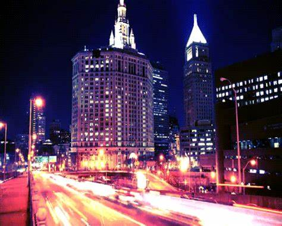

# jiyu0941_9103_tut04

## Definition for individual code
### Jia Yu 540898455

#### Improvement for group code
In order to better expand the group code and respond to the theme of the artwork, I chose **Audio** to improve my individuall code. Based on the regular segment offset of the group code, I added an **electronic music** to make the segment offset more rhythmic.
1. In **sound1**, I used **(let level = amplitude.getLevel())** to get the amplitude of the current audio in real time, so that the offsets of **dynamicXOffset** and **dynamicYOffset** move synchronously according to the audio. In addition, I added function **keyPressed()** to play and pause the music. When the user clicks **"p"**, the music starts playing and the segments begin to decompose. After pressing **"p"** again, the segments will be reassembled and the artwork will be restored.
##### sound1

2. In **sound2**, **alphaValue** is added to the **draw()** method of the **ImageSegment class** to make the **transparency** change with the changes in the audio. The higher the **volume**, the higher the **transparency**, which means that its transparency will be low in the **early stage** of the music and the image will be relatively complete. When the music reaches the **climax**, the transparency of the segments will be the highest and their offset changes will be more obvious.
##### sound2

3. In **sound3**, based on the previous two codes, segments are now dynamically scaled based on the **audio amplitude**. In the **draw()** method of the **ImageSegment** class, the width **(scaledWidth)** and height **(scaledHeight)** of each image segment are now dynamically scaled based on the **audio amplitude**. When the audio amplitude increases, the segments will expand, creating an effect that **jumps with the audio**, which is more in line with the theme of the artwork **"pulsating rhythm and vibrant atmosphere"**. In addition, in the choice of music, I replaced the electronic music with a **stronger sense of rhythm** and **more obvious drums** to make the whole animation more vivid and rhythmic.
##### sound3

The inspiration for the single code is mainly from the **neon lights, traffic and grids of New York City streets** represented by Broadway Boogie Woogie. The changes in the **dynamic offset of segments, the changes in transparency of segments, and the scaling of sizes of segments** all symbolize the **flashing lights and flowing traffic** in the city, and this dynamic effect is exactly what the painter Piet Mondrian expected to see.

##### inspiration

